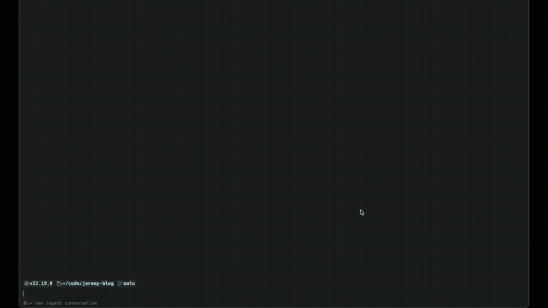

<p align="center">
  <h1 align="center">ccfg</h1>
</p>

<p align="center">
  Claude Code 설정 파일을 한눈에 조회할 수 있는 TUI 대시보드.
</p>

<p align="center">
  <a href="https://go.dev/"></a>
  <a href="LICENSE"></a>
  <a href="https://github.com/jeremy-kr/ccfg/releases"></a>
  <a href="https://github.com/jeremy-kr/tap"></a>
</p>

## 데모

<p align="center">
  
</p>

> [!TIP]
> [VHS](https://github.com/charmbracelet/vhs)로 직접 녹화할 수 있습니다: `vhs docs/demo.tape`

## 왜 ccfg인가?

Claude Code는 설정을 **3가지 스코프에 걸쳐 8개 이상의 파일**에 분산 저장합니다:

```
~/.claude/settings.json              # 사용자 환경 설정
~/.claude/CLAUDE.md                  # 글로벌 지시사항
~/.mcp.json                          # 글로벌 MCP 서버
project/.claude/settings.json        # 프로젝트 오버라이드
project/CLAUDE.md                    # 프로젝트 지시사항
project/.mcp.json                    # 프로젝트 MCP 서버
managed_settings.json                # 조직 정책
policies.json                        # 관리 정책
...그 외 (훅, 키바인딩, 에이전트, 스킬)
```

설정이 충돌하거나 뭔가 안 될 때, 각 파일을 하나씩 열어봐야 합니다. **ccfg**는 모든 설정을 한 화면에서 탐색할 수 있게 해줍니다.

## 기능

- **통합 뷰** — 관리·사용자·프로젝트 설정 파일을 나란히 조회
- **트리 탐색** — 스코프별로 정리된 설정 파일을 접고 펼치며 탐색
- **구문 강조** — JSON/JSONC는 Chroma로, Markdown은 Glamour로 렌더링
- **병합 뷰** — 최종 병합된 설정을 출처 표시와 함께 조회
- **검색** — 모든 파일에서 키 또는 값으로 설정 검색
- **자동 갱신** — fsnotify로 파일 변경을 감지하여 실시간 업데이트
- **확장 스캔** — 커스텀 명령어, 에이전트 스킬, 훅, MCP 서버, 키바인딩
- **사용량 랭킹** — 도구/에이전트/스킬 사용 통계를 SSS~F 등급으로 게이미피케이션, 기간별 필터 (24h/7d/30d/All)
- **캐릭터 카드** — 커스텀 에이전트와 스킬을 게임 스타일 카드로 표시
- **읽기 전용** — 설정 파일을 절대 수정하지 않음

## 설치

### Homebrew (권장)

```bash
brew install jeremy-kr/tap/ccfg
```

### Go Install

```bash
go install github.com/jeremy-kr/ccfg/cmd/ccfg@latest
```

### 소스에서 빌드

```bash
git clone https://github.com/jeremy-kr/ccfg.git
cd ccfg
go build -o ccfg ./cmd/ccfg
```

## 사용법

프로젝트 디렉토리에서 `ccfg`를 실행합니다:

```bash
ccfg
```

### 키 바인딩

| 키                   | 동작                                  |
| -------------------- | ------------------------------------- |
| `j/k` 또는 `Up/Down` | 트리 항목 이동                        |
| `Enter`              | 노드 펼치기/접기 또는 파일 선택       |
| `Tab` 또는 `h/l`     | 좌/우 패널 전환                       |
| `/`                  | 검색 모드 진입                        |
| `Esc`                | 검색 종료 / 뒤로                      |
| `m`                  | 병합 뷰 토글                          |
| `1/2/3`              | 랭킹 탭 전환 (도구 / 에이전트 / 스킬) |
| `s`                  | 랭킹 스코프 토글 (전체 / 프로젝트)    |
| `p`                  | 랭킹 기간 전환 (All / 30d / 7d / 24h) |
| `q` / `Ctrl+C`       | 종료                                  |

### 플래그

```bash
ccfg --version    # 버전 출력
```

## 스캔 대상 파일

ccfg는 세 가지 스코프에서 설정 파일을 탐색합니다:

| 스코프      | 예시                                                            |
| ----------- | --------------------------------------------------------------- |
| **Managed** | `managed_settings.json`, `policies.json`                        |
| **User**    | `~/.claude/settings.json`, `~/.claude/CLAUDE.md`, `~/.mcp.json` |
| **Project** | `.claude/settings.json`, `CLAUDE.md`, `.mcp.json`               |

전체 목록은 [docs/PRD.md](docs/PRD.md)를 참고하세요.

## 기술 스택

- **언어:** [Go](https://go.dev/) 1.26
- **TUI 프레임워크:** [Bubbletea](https://github.com/charmbracelet/bubbletea) v1.3.x (Elm Architecture)
- **스타일링:** [Lipgloss](https://github.com/charmbracelet/lipgloss)
- **구문 강조:** [Glamour](https://github.com/charmbracelet/glamour) + [Chroma](https://github.com/alecthomas/chroma)
- **파일 감시:** [fsnotify](https://github.com/fsnotify/fsnotify)

## 응원하기

ccfg가 유용하셨다면 GitHub에서 **스타**를 눌러주세요 — 더 많은 사람들이 프로젝트를 발견할 수 있습니다!

## 기여하기

개발 환경 설정, 코딩 컨벤션, PR 프로세스는 [CONTRIBUTING.ko.md](CONTRIBUTING.ko.md)를 참고하세요.

## 라이선스

[MIT](LICENSE)
